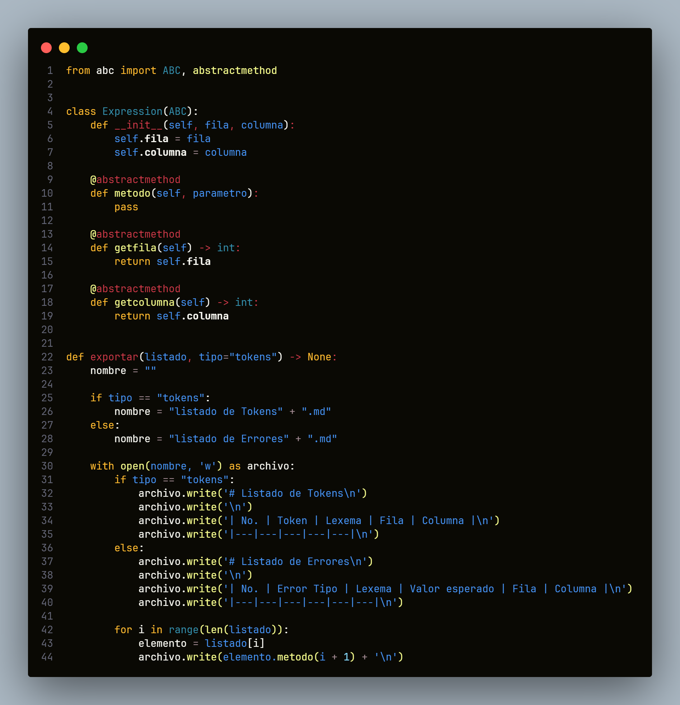
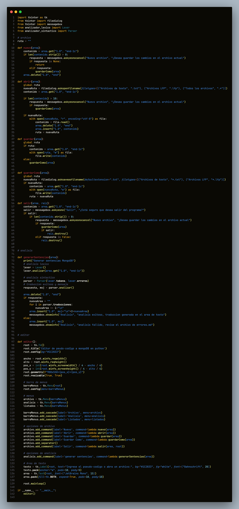

# MANUAL TECNICO

## TABLA DE TOKENS

| Token             | lexema            | Patrón                    |
|-------------------|-------------------|---------------------------|
| reservada         | CrearBD           | $(A-Z)(a-z)^{+}(A-Z)^{+}$ |
| reservada         | EliminarBD        | $(A-Z)(a-z)^{+}(A-Z)^{+}$ |
| reservada         | CrearColeccion    | $(A-Z)(a-z)^{+}$          |
| reservada         | EliminarColeccion | $(A-Z)(a-z)^{+}$          |
| reservada         | InsertarUnico     | $(A-Z)(a-z)^{+}$          |
| reservada         | ActualizarUnico   | $(A-Z)(a-z)^{+}$          |
| reservada         | EliminarUnico     | $(A-Z)(a-z)^{+}$          |
| reservada         | BuscarTodo        | $(A-Z)(a-z)^{+}$          |
| reservada         | BuscarUnico       | $(A-Z)(a-z)^{+}$          |
| nueva             | nueva             | $(a-z)^{+}$               |
| valor             | valor             | " ( [ ^ " ] * )"          |
| identificador     | identificador     | $(a-z)^{+}$               |
| igual             | =                 | =                         |
| abre parentesis   | (                 | (                         |
| cierra parentesis | )                 | )                         |
| separador         | ,                 | ,                         |
| fin sentencia     | ;                 | ;                         |

Nota: recordemos que la notación " ( [ ^ " ] * ) " quiere decir guardará cero o más veces cualquier valor que sea diferente de las comillas dobles, iniciará a capturar la cadena desde la comilla doble y cuando venga una comilla doble nuevamente dejará de capturar.

## METODO DEL ARBOL

Luego de haber realizado el arbol procedemos a tabular la información, la tabla izquierda es en la inicialmente transcribo los resultados de los siguientes de mi arbol

la tabla del centro es en que creo estados que no existen, como el estado (7,10) y el estado (8,10), esto se hace para evitar que el AFD se convierta en un AFN.

Y por último en la tabla de la derecha cambio el nombre de los estados y determino mis estados finales, resaltados en morado hay 2 estados que no producen ningún tipo de resultado, por lo cual los eliminé del automata final, ya que el automata generado por el método del arbol me generó estados por si quisiera pasar más de 2 argumentos dentro de los parentesis.

## AUTOMATA FINITO DETERMINISTA

El automata generado con la tabla final ( donde renombré los estados con simbología $s_i$ ) fue:

## GRAMATICA LIBRE DE CONTEXTO

| No terminal |    | Producción       |
|-------------|----|------------------|
| S           | -> | E                |
| E           | -> | P I = E          |
| E           | -> | nueva P ( T ) ;  |
| T           | -> | V T              |
| T           | -> | , T              |
| T           | -> | ε                |
| P           | -> | reservada        |
| I           | -> | identificador    |
| V           | -> | valor            |

## EXPLICACIÓN DEL CÓDIGO

### Expression

La clase abstracto es la base desde la cual nace lexema, solamente cuenta con los atributos de linea y columna, así como de los métodos de getfila(), getcolumna() y metodo(parametro). Este último lo utilizamos en las clases de Token y Error para poder escribir un string con el formato de una fila para una tabla en markdown, ya que las exportaciones las hacemos en formato markdown.

Como puede observarse dentro de esta clase tenemos el método de exportar donde se recibimos un listado y el tipo de contenido del listado, esto es útil, puesto que nos permite exportar los errores y los tokens sin la necesidad de crear más de un método.

### Lexema

La clase lexema hereda de la clase Expression y agrega un nuevo atributo que es el lexema. Además en este mismo modulo agregamos un método que se encarga de armar un lexema, dependiendo del tipo de parametro secundario que le envie, ya que si no se le envia nada, se tomará como armar un lexema externo (armar palabras reservadas e identificadores); también puede enviarse parametros tipo c1 y c2, estos son los tipos de comentarios, por ello hay casos especiales, ya que la estructura para armar el lexema de los comentarios se restringe a finalizar con un caracter tipo '\n' o la secuencia '*/'.

Además en caso de no optar ni por c1, ni por c2, ni por el valor ext, se armará un valor interno, para hacer esto se necesitó de un for para que recorriera internamente los valores entre comillas y así poder almacenar lo que sea dentro de ellos. Donde se nota la utilidad real de esta condición, es cuando tenemos que armar un lexema tipo Json, ya que pueden traer comillas de cierre, en cuyo caso tronaría el programa, pero en este caso, se necesita de la secuencia '")' para finalizar de armar el lexema.

### Token y Error

Estas clases heredan de Lexema y solamente se enfocan en tener un tipo especifico de objeto para los tokens y los errores, ya que al tener que devolver un valor esperado en los errores sintacticos, debemos tener espacio para recordar (por cada error) el valor que se esperaba en vez del incorrecto.

En cuanto a los tokens la estructura es solamente añadirle un atributo token que me permite clasificar mis tokens acorde a la tabla vista al comienzo de este manual técnico.

Cabe recalcar que la en el método metodo() de ambas clases, varía unicamente en la cantidad de columnas (valores insertados en un f string) que retornamos. La funcionalidad es la misma la momento de exportar.

### Analizador Lexico

También llamado Lexer, es el que verifica que todo aquel lexema que entre (o caracter), pertenezca a mi lenguaje, en este caso, obtendrá todos los caracteres importantes que tengan que ver con parentesis, punto y coma, coma, cadenas de texto sin caracteres especiales de por medio, el símbolo de igual, los guiones medios, los slash y las comillas dobles.

En cualquier otro caso tomará en cuenta unicamente las columnas y filas en las que se encuentren los errores, en caso ser sentencias de escape tipo '\n', '\t', '\r' y ' ', tomará en cuenta unicamente las columnas y filas que estas sentencias representen.

Notese que cuenta con 3 listados diferentes, lexemas, tokens y errores. Listados de los cuales al finalizar el analisis lexico, nos interesarán únicamente el de tokens y erroes, pues son los necesarios para comenzar con la segunda fase del analisis, el analisis sintactico.

### Analizador Sintactico

El analizador sintactico o parser, es el que se encarga de realizar el analisis de tal forma que verifica si la estrucura de la entradas de token coincide con la estructura de una sentencia valida, dentro de este analisis se tomó en cuenta las tres posibles estructuras posibles, de las cuales sus funciones son contadas y únicas, es decir:

| Estructura | Funciones que cumplen dicha estructura|
|---|---|
| Reservada Identificador = nueva Rerservada ( ) ; | CrearBD y EliminarBD |
| Reservada Identificador = nueva Rerservada ( Nombre ) ; | CrearColeccion, EliminarColeccion, BuscarTodo y BuscarUnico |
| Reservada Identificador = nueva Rerservada ( Nombre , Json ) ; | InsertarUnico, ActualizarUnico y EliminarUnico |
| Cualquier otra | debe verificarse si es un comentario tipo c1, c2 o si es un error |

Para la verificación de errores se crearon condicionales un tanto largos, pero son los que permiten saber que tipo de error es el que está sucediendo, además de guardarlo en el listado de erroes, como un objeto de tipo error, para hacer más facil su manejo y su exportación

### Funcion

Para esta clase, no heredamos nada y para que funcione correctamente, debemos haber levantado la clase Analizador_sintactico, ya que es la que hace uso de esta clase auxiliar, misma clase que en su método traducir(), traduce las instrucciones enviadas como sentencias de linea completas.

Esta clase recibe unicamente los lexemas obtenidos de los tokens de la lista de tokens que entra al analizador sintactico, si se envian otro tipo de datos que no sean strings, esta clase falla, ya que no está hecha para recibir otro tipo de datos.

Y de hecho no es necesario codificar la captura de los errores, porque al saber que el analizador sintactico puede o no devolver errores sintacticos, ya sabremos que si devuelve errores sintacticos no será posible traducir, pero si no hay errores sintacticos, entonces funcionará todo correctamente y obtendremos nuestra traducción.

### Interfaz

Por último tenemos la interfaz, esta clase es solamente ejecutar una ventana con las funciones necesarias para que se ejecute correctamente, debido a que se nos pidió abrir un menú desplegable que tenga las opciones de abrir, nuevo, guardar, guardar como y salir.

Todas esas funciones trabajan de tal forma que nos preguntará si queremos guardar el archivo actual antes de realizar cualquier tipo de cambio. En las otras funciones como GenerarSentencias() y editor(), son especificas para la lógica y la creación de la ventana.

El editor es la ventan como tal, por ello al inicializar la clase como un script y no como un modulo, ejecutamos la función editor(), porque en sí es la encargada del Frontend y la función GenerarSentencias() es la que se encarga de ejecutar los analizadores lexico y luego el sintactico. 

Funcionan de tal manera que al tener errores lexicos, no habrán problemas mayores, puesto que si se podrá traducir, pero si hay errores sintacticos lanzará un texto que pedirá verificar el archivo errores.md que contendrá los errores sintacticos y lexicos encontrados dentro del archivo.

En el caso de las exportaciones de tokens y de errores ambos se harán en formato MarkDown por comodidad y flexibilidad.

